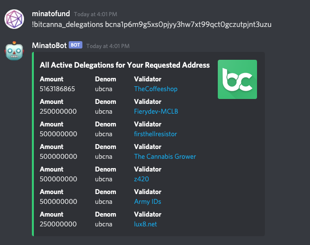

# MinatoBot
Discord bot for Minato Fund. 
Work in progress now, please feel free to contribute.

## Available Commands

```
  bitcanna_delegation     All Active Delegations for Your Requested Address
  bitcanna_delegations    All Active Delegations for Your Requested Address
  bitcanna_redelegations  Redelegation For The Requested Address
  bitcanna_staking_params Current Staking Params
  bitcanna_staking_pool   Staking Pool Details
  bitcanna_validator      Staking Details for Your Requested Address
  faucet                  Get airdrop token from faucet.
  help                    Shows this message
  luaswap_user            Query Luaswap user by Subgraph
  validator_status        Show validator status with given project name
``` 

## BitCanna Bot Features
Now, this bot is able to check staking information about BitCanna. 
Users can access it easily in Discord channels without open explorer.




